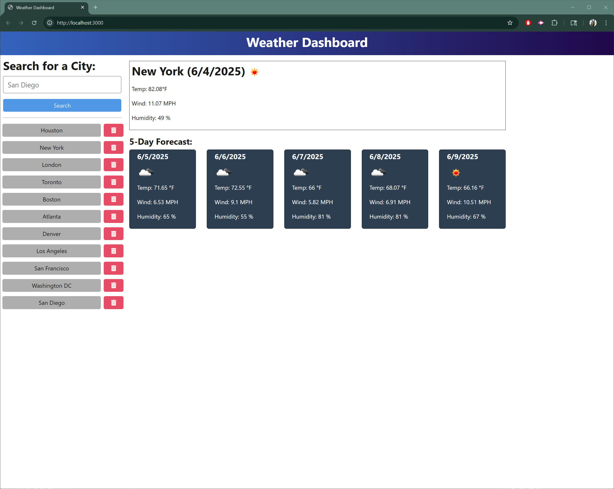

# Weather Dashboard - Module 09 Challenge

## Description
This is a full-stack weather dashboard application built for the Module 09 Challenge. The backend is built with Node.js, Express, and TypeScript, and the frontend is a modern, responsive web app. The dashboard allows users to search for a city, view the current weather and a 5-day forecast, and manage their search history. All weather data is fetched from the OpenWeather API.

## Features
- Search for any city to view current weather and a 5-day forecast
- Weather data includes city name, date, weather icon, description, temperature, humidity, and wind speed
- Search history is saved and displayed; users can re-select or delete previous searches
- All backend API endpoints are robust and return consistent data
- Application is ready for deployment on Render

## Technologies Used
- Node.js
- Express
- TypeScript
- Fetch API (frontend)
- OpenWeather API
- HTML/CSS/JS (frontend)

## Getting Started
1. Clone this repository.
2. Run `npm install` in the `server` directory.
3. Create a `.env` file in the `server` directory with your OpenWeather API key:
   ```
   OPENWEATHER_API_KEY=your_api_key_here
   ```
4. Start the server with `npm start`.
5. Visit `http://localhost:3001` in your browser.

## API Endpoints
- `POST /api/weather` — Search for a city and get weather data (body: `{ city: "CityName" }`)
- `GET /api/weather/history` — Get all saved cities
- `DELETE /api/weather/history/:id` — Delete a city from history

## Deployment
- This app is ready for deployment on Render. Ensure your `.env` and `.gitignore` are set up as shown above.

- Link: <>

## Screenshot


## License
MIT
